# Lerree Lab — личный кабинет участницы фитнес-клуба

Итоговый проект курса «AI-агенты в разработке»: **полнофункциональное веб-приложение, сделанное
с AI-агентом на всех этапах** — от анализа конкурентов до продакшна. Инструмент — Claude Code.

**Сайт:** <https://lerree-lab-dz-cicd.vercel.app> ·
**Проверка здоровья:** [/api/health](https://lerree-lab-dz-cicd.vercel.app/api/health)

Демо-доступы, пароль для обоих `demo1234`:

- `anna@demo.ru` — подписка активна, виден весь кабинет;
- `olga@demo.ru` — подписка истекла, виден экран продления.

Вход через Google работает в режиме Testing (только для тестировщиков из Google Console), поэтому
для проверки — демо-пароль.

Проект учебный, содержимое вымышленное. Боевой Lerree Lab с платным контентом клуба живёт в
закрытом репозитории; здесь — его полноценная демо-копия на отдельной базе.

---

## Идея

Закрытый онлайн-клуб тренера раздаёт тренировки в Telegram и PDF: участницы теряют рабочие веса,
ищут разборы техники в ленте и ведут замеры в заметках, а доступ после окончания подписки
снимается вручную.

Lerree Lab собирает всё в одном кабинете с доступом строго по активной подписке: программа на
неделю, дневник подходов с подсказкой «что было в прошлый раз», личные замеры, библиотека
материалов с поиском. Аудитория — женщины 25–45 лет, тренируются с телефона в зале.

Чем отличается от FitStars, Trainerize, Hevy и других — в [анализе конкурентов](competitor_analysis.md).

## Возможности

- **Вход** — пароль или Google (OAuth 2.0, PKCE); без активной подписки — экран продления.
- **Программы** — план на неделю, прогресс по программе, тренировки по дням.
- **Тренировка** — вес и повторы по каждому подходу, подсказка прошлой тренировки, проверка
  ввода, черновик не теряется при обрыве связи.
- **Материалы** — статьи, рецепты, подкасты, эфиры; поиск по названию, описанию и тегам.
- **Замеры** — полный CRUD: добавить, посмотреть динамику, исправить, удалить с подтверждением.
  Видны только самой участнице (защита на уровне базы).
- **Состояния** — загрузка, пустой список, ошибка с кнопкой «Попробовать снова»; ошибки сервера
  переведены на понятный язык. Переключатель «Сеть» в шапке имитирует обрыв связи для проверки.

## Скриншоты

| Вход | Программа на неделю |
| --- | --- |
| 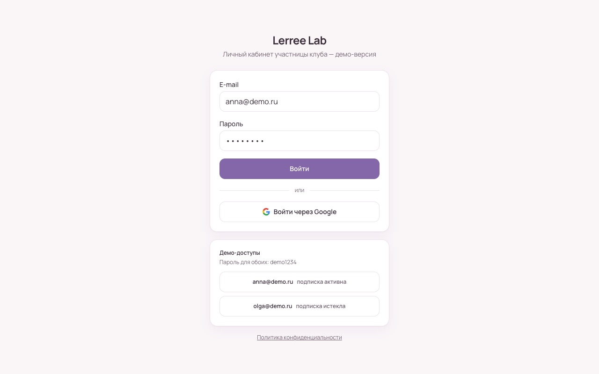 | 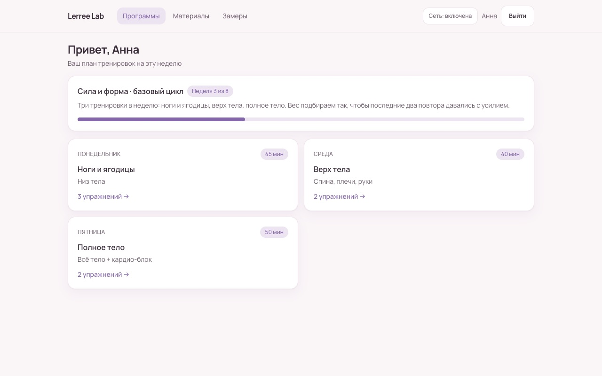 |
| **Тренировка: подходы и «в прошлый раз»** | **Материалы: поиск** |
| 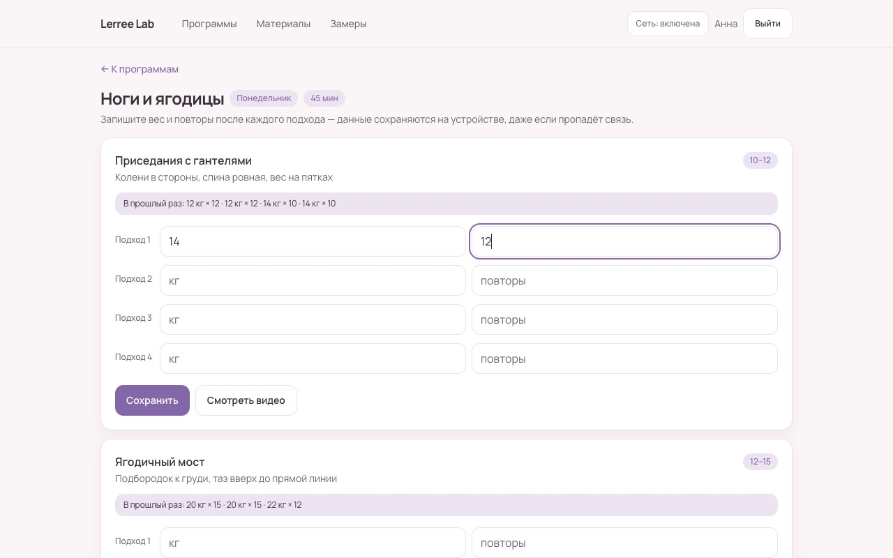 | 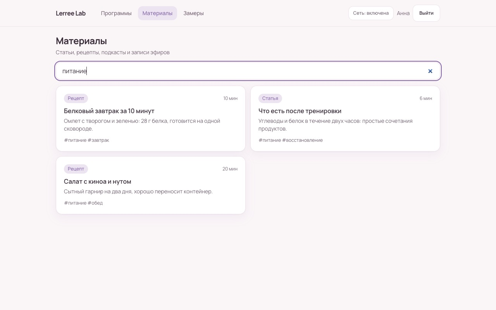 |
| **Замеры: исправление** | **Замеры: удаление с подтверждением** |
| 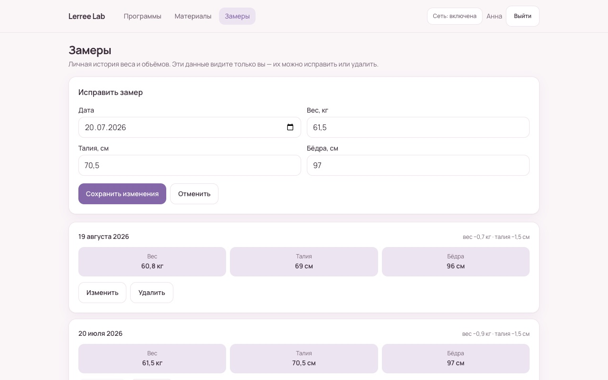 | 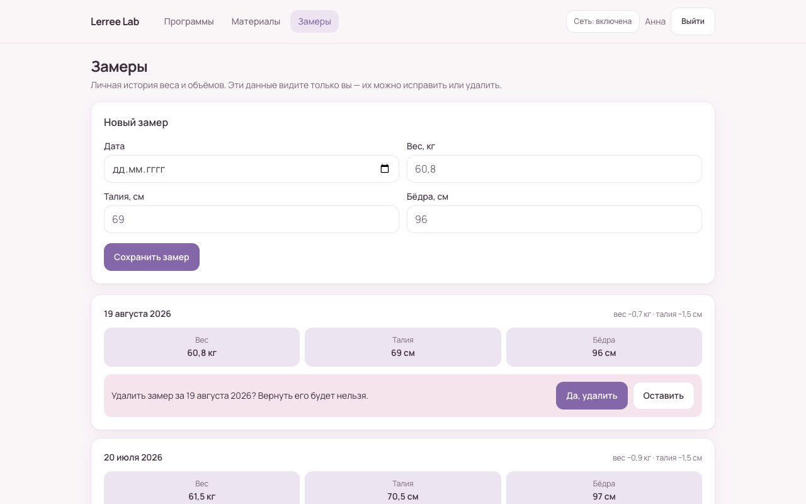 |
| **Подписка закончилась** | **Ошибка: нет связи** |
|  | 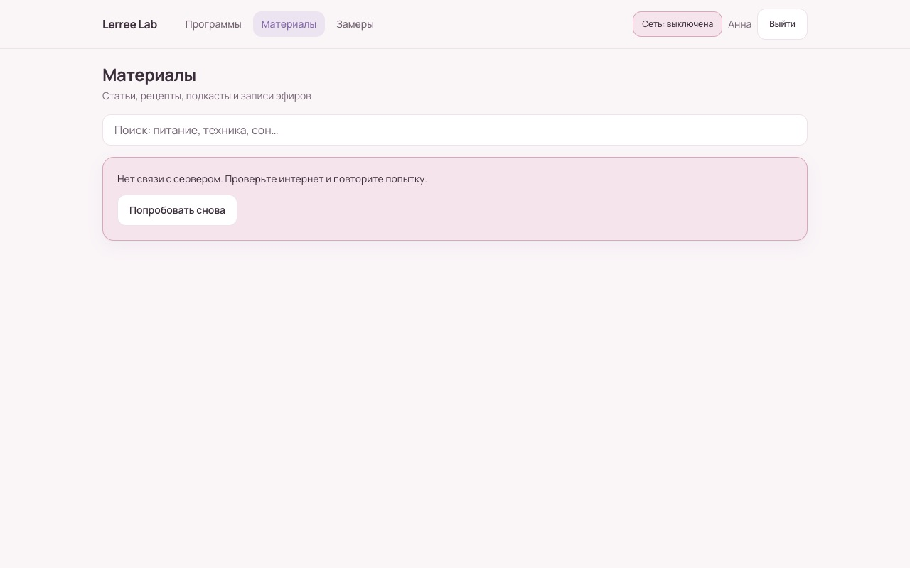 |

Телефон (390 × 844):

| Вход | Программа | Тренировка | Материалы | Замеры | Подписка |
| --- | --- | --- | --- | --- | --- |
| 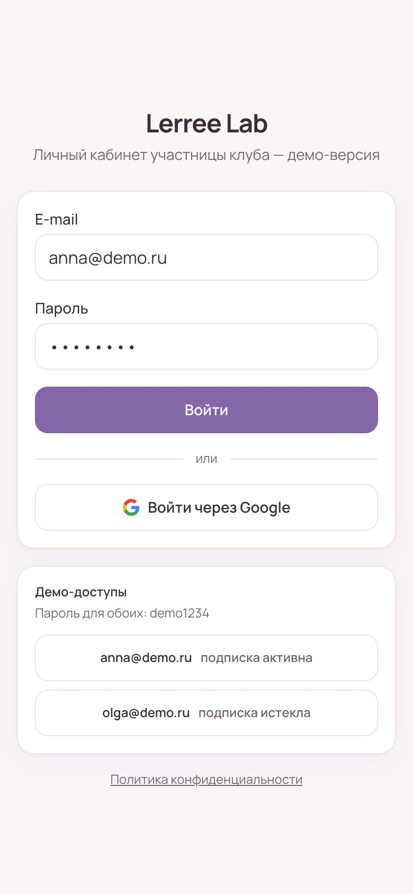 | 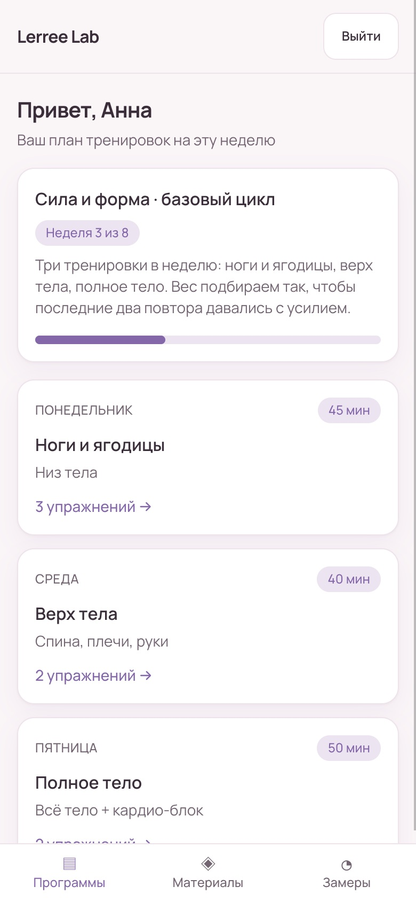 | 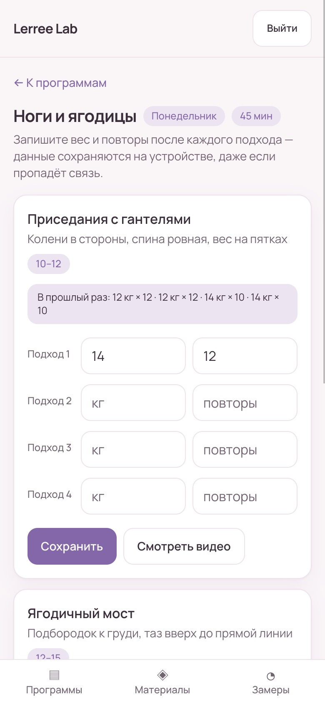 | 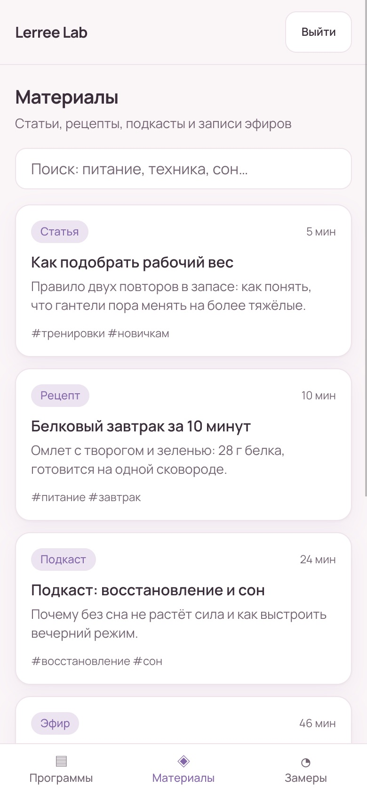 | 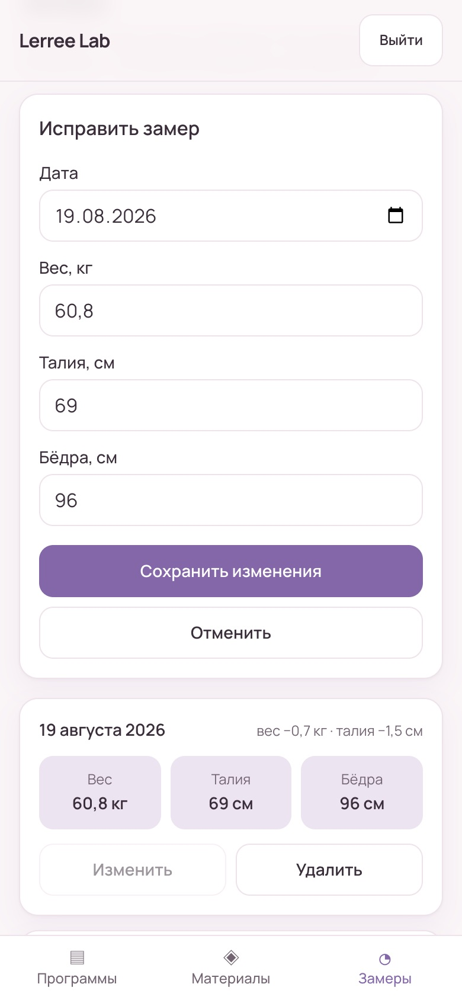 | 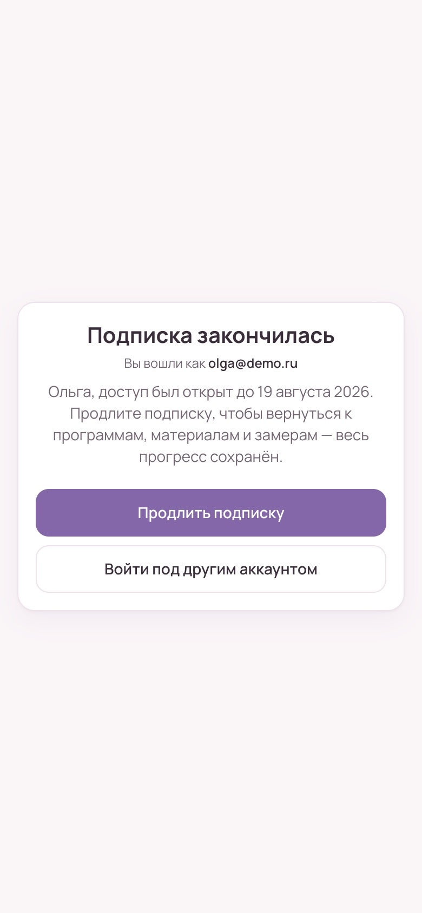 |

## Технологии

- **Frontend:** React 19, TypeScript, Tailwind CSS 4, React Router 7, Vite
- **Backend:** Supabase — PostgreSQL (7 связанных таблиц, RLS на всех), Auth (пароль + Google),
  PostgREST как API; серверные функции Vercel `/api/health` и `/api/log`
- **Инфраструктура:** Vercel, GitHub Actions (CI/CD), Dependabot, Docker (образ приложения на
  nginx + песочница PostgreSQL)
- **Качество:** Vitest + Testing Library (102 теста, покрытие ~89 %), oxlint, Prettier,
  TypeScript strict, `npm audit`
- **Сервисы:** Google OAuth, Яндекс.Метрика (просмотры + 8 целей), мониторинг через GitHub Actions

## Как закрыты требования проекта

- **3+ экрана, адаптивность, формы, загрузка и ошибки** — 8 экранов (вход, программы,
  тренировка, материалы, замеры, подписка, политика конфиденциальности, 404), mobile-first.
- **БД из 3+ связанных таблиц** — `profiles`, `programs`, `workouts`, `exercises`, `materials`,
  `measurements`, `workout_sets` ([схема](supabase/migrations/001_init_schema.sql)).
- **API с CRUD** — [`src/lib/api.ts`](src/lib/api.ts): замеры — создать, прочитать, изменить,
  удалить; подходы — записать и перезаписать.
- **Аутентификация** — Supabase Auth, сессия, защищённые маршруты, доступ по подписке.
- **Валидация** — в форме ([`validation.ts`](src/lib/validation.ts)) и в базе (`check`,
  `unique`, RLS).
- **Дополнительные функции (нужно 2):** OAuth2 через Google; аналитика Яндекс.Метрика; поиск по
  материалам; интеграция с внешними API (Google, Метрика); уведомления о падении сайта (issue и
  письмо GitHub).
- **Деплой и CI/CD** — автоматическая выкладка из `main`, превью на каждый PR.
- **Docker** — [`Dockerfile`](Dockerfile), образ собирается и проверяется в CI.

## Запуск

Нужны Node.js 22 и проект Supabase ([как создать и применить миграции](docs/setup-supabase.md)).

```bash
npm install
cp .env.example .env    # VITE_SUPABASE_URL и VITE_SUPABASE_ANON_KEY своего проекта
npm run dev             # http://localhost:5173
```

Все проверки, как в CI — форматирование, линтер, типы, тесты, уязвимости:

```bash
npm run check
```

### В Docker

```bash
docker compose --profile app up --build   # приложение на http://localhost:8080
docker compose up -d                      # только песочница PostgreSQL для миграций
```

Выкладка в свой аккаунт Vercel — [integration_documentation.md, раздел 1](integration_documentation.md#как-повторить).

## Структура

```
src/pages/                 экраны: вход, программы, тренировка, материалы, замеры, подписка
src/components/            общие элементы: карточки, поля, состояния загрузки и ошибок
src/lib/api.ts             все запросы к базе (CRUD), перевод ошибок сервера
src/lib/validation.ts      проверка форм
api/health.ts, api/log.ts  серверные функции Vercel
supabase/migrations/       схема, RLS-политики, контент, исправления аудита
Dockerfile, docker/        образ приложения (nginx) и песочница базы
.github/workflows/         CI/CD, мониторинг
```

## Документация

- **[ai_development_process.md](ai_development_process.md)** — как AI-агент участвовал в каждом
  этапе: промпты, результаты, проблемы и решения, выводы
- **[competitor_analysis.md](competitor_analysis.md)** — анализ конкурентов
- **[Презентация для защиты](docs/presentation/lerree-lab-final.pptx)** — 14 слайдов с заметками докладчика, [PDF-версия](docs/presentation/lerree-lab-final.pdf)
- **[integration_documentation.md](integration_documentation.md)** — CI/CD, Google, Метрика,
  мониторинг, логирование, оптимизация (Lighthouse до/после)
- **[security_audit.md](security_audit.md)** — аудит по OWASP Top 10: 6 находок, все исправлены
- **[backend_documentation.md](backend_documentation.md)** — база, политики доступа, API (этап ДЗ 5)
- **[docs/log-analysis/](docs/log-analysis/README.md)** — анализ логов с AI

История по этапам — отдельные репозитории домашних заданий:
[выбор инструментов](https://github.com/zaremaabdulganieva-cmyk/lerree-lab-dz-ai-tools) ·
[правила и промпты](https://github.com/zaremaabdulganieva-cmyk/lerree-lab-dz-ai-rules) ·
[UI-концепции и ТЗ](https://github.com/zaremaabdulganieva-cmyk/lerree-lab-dz-ui-tz) ·
[frontend](https://github.com/zaremaabdulganieva-cmyk/lerree-lab-dz-frontend) ·
[backend](https://github.com/zaremaabdulganieva-cmyk/lerree-lab-dz-backend). Версия, сданная как
ДЗ 6, — тег [`dz6`](https://github.com/zaremaabdulganieva-cmyk/lerree-lab-dz-cicd/tree/dz6).

## Как использовался AI

Весь код, SQL, конфигурации и документы написаны **Claude Code** по задачам автора — проектного
менеджера, не разработчика. Автор ставил задачи, принимал решения и проверял результат на каждом
чекпоинте; ключи, пароли и личные кабинеты (Google, Supabase, Vercel, Метрика) — только автор.
Подробно — в [ai_development_process.md](ai_development_process.md).
