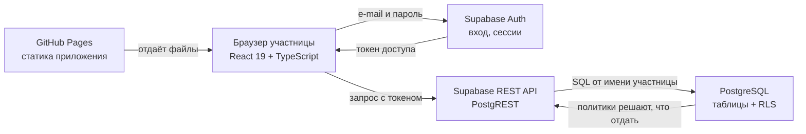
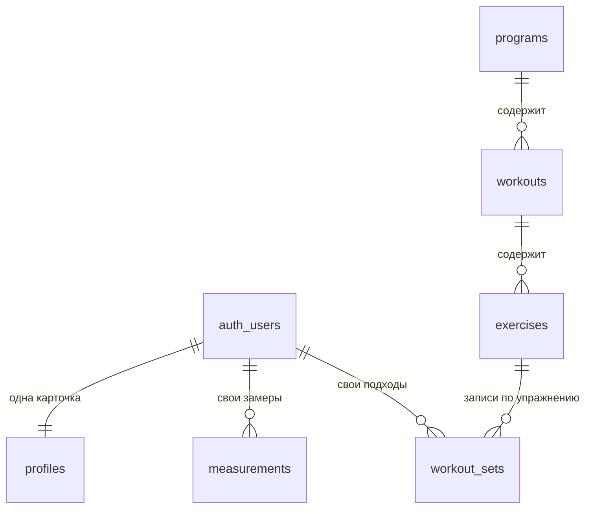

# Backend демо-кабинета Lerree Lab

Документация к ДЗ «Развертывание Backend и интеграция с Frontend».

Приложение — личный кабинет участницы фитнес-клуба: программа тренировок,
запись рабочих весов, материалы, личные замеры. Интерфейс сделан в
предыдущем задании и работал на выдуманных данных; здесь под него
поднята настоящая база, а данные из кода убраны.

Проект учебный: содержимое клуба вымышленное, боевая база и платный
контент остаются в закрытом репозитории.

---

## 1. Архитектура решения



Ключевая мысль: **правила доступа живут в базе, а не в приложении.**
Приложение в браузере можно открыть, изучить и подделать любой его запрос —
поэтому оно ничего не решает. Кто что видит, определяют политики
PostgreSQL (Row Level Security), и обойти их запросом мимо интерфейса нельзя.

Слои:

| Слой | Чем занят | Где лежит |
|---|---|---|
| Интерфейс | экраны, формы, состояния загрузки | `src/pages`, `src/components` |
| Слой запросов | единственное место, где приложение знает про Supabase | `src/lib/api.ts` |
| Разбор ошибок | перевод кодов сервера в человеческие фразы | `src/lib/errors.ts` |
| База | таблицы, ограничения, политики доступа | `supabase/migrations` |

---

## 2. Выбор инфраструктуры

Выбран **Supabase** (backend as a service), а не собственный сервер.

Почему:

- **Так устроен боевой проект.** Настоящий Lerree Lab уже работает на
  Supabase: 16 таблиц, 41 политика доступа. Учебная задача должна
  повторять реальную, иначе полученный опыт некуда применить.
- **Аутентификация из коробки.** Регистрация, вход, обновление токенов,
  восстановление пароля — то, что писать самому долго, а ошибиться
  дорого.
- **Правила доступа проверяются в одном месте.** RLS работает и для
  приложения, и для любого прямого обращения к API.
- **Цена и сопровождение.** Бесплатный тариф покрывает демонстрацию;
  своего сервера, который надо обновлять и охранять, не появляется.

Что теряем: привязку к поставщику. Для этого проекта риск приемлемый —
под капотом обычный PostgreSQL, схема переносится дампом, а миграции
в этом репозитории написаны на чистом SQL и не используют ничего
специфического, кроме схемы `auth`.

**Проект Supabase — общий с другим приложением.** На бесплатном тарифе
два активных проекта, оба заняты (боевой клуб и студия постов
fingram-studio). Боевой отпал сразу: миграции совпадают с ним по именам
таблиц и перезаписали бы его правила доступа, а опубликованный демо-
пароль давал бы любому аккаунт в базе с живыми участницами. Демо
поселено в fingram-studio после проверки на копии:

- имена таблиц, функций и триггеров не пересекаются;
- fingram не пользуется входом Supabase, демо-участницы ему не мешают;
- таблицы fingram закрыты защитой без разрешений — вошедшая демо-
  участница видит 0 его строк;
- права и защита fingram до и после миграций совпадают;
- миграции отзывают права гостя только у своих таблиц, не у всех в схеме;
- `scripts/remove-demo.sql` убирает демо целиком и только его.

Собственный сервер (PostgreSQL в Docker на VPS) в репозитории тоже есть,
но в роли **локальной песочницы**: `docker-compose.yml` поднимает базу на
своём компьютере, чтобы прогнать миграции и проверить политики до того,
как что-то менять в облаке. Схема `auth`, которую в облаке ведёт сам
Supabase, заменена минимальной заглушкой (`docker/00_auth_stub.sql`).

---

## 3. Схема базы данных



**Общий контент клуба** (одинаков для всех участниц):

- `programs` — программа: название, описание, длительность в неделях,
  текущая неделя, признак публикации.
- `workouts` — тренировка внутри программы: день, длительность, акцент,
  порядок в списке.
- `exercises` — упражнение внутри тренировки: подсказка по технике,
  число подходов, диапазон повторов, есть ли видео.
- `materials` — статьи, рецепты, подкасты, эфиры; теги хранятся массивом.

**Личные данные участницы:**

- `profiles` — имя, роль (`member` / `admin`), статус подписки и дата
  окончания. Связана один-к-одному со служебной таблицей `auth.users`,
  где Supabase хранит e-mail и пароль.
- `measurements` — замер на дату: вес, талия, бёдра. Пара
  «участница + дата» уникальна, поэтому двойное нажатие кнопки не создаёт
  дубль.
- `workout_sets` — один подход: упражнение, дата, номер подхода, вес,
  повторы. Плоская запись позволяет считать прогресс обычным SQL.

**Представление** `last_workout_sets` — подсказка «в прошлый раз».
Не хранится, а вычисляется: берётся последний день до сегодняшнего,
когда участница записывала этот подход.

**Проверки на уровне базы** (не дадут записать бессмыслицу даже в обход
интерфейса): вес замера 30–300 кг, объёмы 40–200 см, рабочий вес
0–500 кг, повторы 1–100, число подходов 1–10, текущая неделя не больше
длительности программы.

**Автоматика:**

- триггер `on_auth_user_created` — при регистрации сам создаёт карточку
  в `profiles`;
- триггер `profiles_guard` — не даёт участнице поменять себе роль или
  срок подписки;
- триггер `workout_sets_touch` — отмечает время правки подхода.

---

## 4. Развёртывание

### 4.1. Облако (Supabase) — основной вариант

1. Открыть проект Supabase (в нашем случае — существующий
   fingram-studio; подойдёт и новый пустой).
2. Открыть **SQL Editor** и выполнить по очереди, каждый файл отдельным
   запуском:
   - `supabase/migrations/001_init_schema.sql`
   - `supabase/migrations/002_rls_policies.sql`
   - `supabase/migrations/003_seed_content.sql`
3. **Authentication → Users → Add user** — создать двух демо-участниц
   с включённой галочкой «Auto Confirm User»:
   - `anna@demo.ru` / `demo1234`
   - `olga@demo.ru` / `demo1234`
4. Выполнить `supabase/migrations/004_demo_users.sql` — он проставит
   Анне активную подписку, Ольге истёкшую и добавит историю.
5. **Settings → API** — скопировать `Project URL` и ключ `anon public`.
6. Записать их в `.env` приложения:

   ```bash
   cp .env.example .env
   # VITE_SUPABASE_URL=https://<идентификатор>.supabase.co
   # VITE_SUPABASE_ANON_KEY=<ключ anon>
   ```

7. Проверить политики доступа (строка подключения — в **Settings →
   Database → Connection string**):

   ```bash
   psql "<строка подключения>" -f scripts/check-rls.sql
   ```

   Ожидаемый ответ последней строкой: `ВСЕ ПРОВЕРКИ ПРОЙДЕНЫ`.

Подробная инструкция по шагам — в
[`docs/setup-supabase.md`](docs/setup-supabase.md).

Уборка после курса: `scripts/remove-demo.sql` — удаляет только объекты
демо, соседнее приложение не затрагивает.

### 4.2. Приложение

Локально:

```bash
npm install
npm run dev
```

Публикация на GitHub Pages происходит сама при push в `main`
(`.github/workflows/deploy.yml`). Перед первым запуском в репозитории
нужно задать два секрета: **Settings → Secrets and variables → Actions**
→ `VITE_SUPABASE_URL` и `VITE_SUPABASE_ANON_KEY`.

### 4.3. Локальная песочница в Docker

Нужна, чтобы прогнать миграции у себя, не трогая облако:

```bash
cp .env.example .env          # задать POSTGRES_PASSWORD
docker compose up -d
```

Миграции применяются сами при первом запуске. Проверить, что всё встало,
и прогнать проверки безопасности:

```bash
docker compose exec db psql -U postgres -d lerree_demo -c '\dt'
psql "postgresql://postgres:<пароль>@127.0.0.1:54329/lerree_demo" -f scripts/check-rls.sql
```

Порт открыт только на `127.0.0.1`: снаружи в эту базу зайти нельзя.

---

## 5. API

Отдельный сервер не писался: Supabase публикует REST API поверх таблиц
(PostgREST). Каждая таблица и представление доступны по адресу
`/rest/v1/<имя>`, а права проверяются политиками из миграции 002.

Во всех запросах два заголовка:

- `apikey` — публичный ключ `anon`;
- `Authorization: Bearer <токен>` — токен, полученный при входе.

Ниже `$URL` — адрес проекта, `$ANON` — публичный ключ, `$TOKEN` — токен
участницы.

### Вход

```bash
curl -X POST "$URL/auth/v1/token?grant_type=password" \
  -H "apikey: $ANON" -H "Content-Type: application/json" \
  -d '{"email":"anna@demo.ru","password":"demo1234"}'
```

Ответ содержит `access_token` — его и подставляем дальше.

### Программа с тренировками и упражнениями (чтение)

```bash
curl "$URL/rest/v1/programs?select=id,title,weeks,current_week,workouts(id,title,day_label,exercises(id,title,planned_sets))" \
  -H "apikey: $ANON" -H "Authorization: Bearer $TOKEN"
```

Вложенность разворачивается одним запросом — отдельные обращения за
тренировками и упражнениями не нужны.

### Материалы (чтение)

```bash
curl "$URL/rest/v1/materials?select=id,title,kind,tags,minutes&order=created_at" \
  -H "apikey: $ANON" -H "Authorization: Bearer $TOKEN"
```

### Замеры

Чтение своей истории:

```bash
curl "$URL/rest/v1/measurements?select=id,measured_on,weight_kg,waist_cm,hips_cm&order=measured_on" \
  -H "apikey: $ANON" -H "Authorization: Bearer $TOKEN"
```

Добавление:

```bash
curl -X POST "$URL/rest/v1/measurements" \
  -H "apikey: $ANON" -H "Authorization: Bearer $TOKEN" \
  -H "Content-Type: application/json" -H "Prefer: return=representation" \
  -d '{"user_id":"<id участницы>","measured_on":"2026-09-01","weight_kg":60.1,"waist_cm":68,"hips_cm":95}'
```

Удаление своей записи:

```bash
curl -X DELETE "$URL/rest/v1/measurements?id=eq.<id записи>" \
  -H "apikey: $ANON" -H "Authorization: Bearer $TOKEN"
```

### Подходы на тренировке

Сегодняшние подходы:

```bash
curl "$URL/rest/v1/workout_sets?select=exercise_id,set_index,kg,reps&performed_on=eq.2026-09-10" \
  -H "apikey: $ANON" -H "Authorization: Bearer $TOKEN"
```

Запись подходов:

```bash
curl -X POST "$URL/rest/v1/workout_sets" \
  -H "apikey: $ANON" -H "Authorization: Bearer $TOKEN" \
  -H "Content-Type: application/json" \
  -d '[{"user_id":"<id>","exercise_id":"<id>","performed_on":"2026-09-10","set_index":1,"kg":12,"reps":12}]'
```

Подсказка «в прошлый раз»:

```bash
curl "$URL/rest/v1/last_workout_sets?select=exercise_id,set_index,kg,reps" \
  -H "apikey: $ANON" -H "Authorization: Bearer $TOKEN"
```

### Что вернёт сервер, если правила нарушены

| Ситуация | Ответ |
|---|---|
| Нет заголовка `Authorization` | `401`, данных нет |
| Подписка истекла, запрос контента | `200` и пустой список |
| Запрос чужих замеров | `200` и пустой список |
| Замер на чужой `user_id` | `403`, код `42501` |
| Вес 500 кг | `400`, код `23514` |
| Второй замер на ту же дату | `409`, код `23505` |

Пустой список вместо ошибки — это не недосмотр, а поведение RLS: строки,
на которые нет прав, просто не попадают в выборку. Приложение отличает
«ничего не нашлось» от «доступ закрыт» по статусу подписки в профиле.

---

## 6. Безопасность

**Аутентификация.** Supabase Auth: e-mail и пароль, токен доступа с
коротким сроком жизни и автоматическим обновлением. Пароли хранит
Supabase, приложение их не видит и никуда не пишет.

**Политики доступа.** Включены на всех семи таблицах. Коротко:

- контент клуба (`programs`, `workouts`, `exercises`, `materials`) —
  только чтение и только для действующей участницы; политик на запись
  нет вовсе, поэтому изменить контент через API невозможно;
- `measurements` и `workout_sets` — чтение и запись строго своих строк;
- `profiles` — своя карточка; роль и подписку меняет только
  администратор (проверяется триггером);
- роль `anon` (посетитель без входа) не имеет прав ни на что.

«Действующая участница» вычисляется функцией `is_active_member`: роль
`admin` либо активная и непросроченная подписка.

**Ключи и секреты.** В коде их нет. Публичный ключ `anon` подставляется
при сборке из `.env` (локально) или из секретов репозитория (GitHub
Actions); он не секретный — его видно в любом браузере, и сам по себе он
не даёт доступа к данным. Секретный ключ `service_role` в приложении не
используется: с ним политики не действуют, и в браузере ему не место.
Файл `.env` добавлен в `.gitignore`.

**CORS.** Supabase отдаёт REST API и Auth с разрешающими заголовками
CORS, поэтому обращения из браузера с домена GitHub Pages проходят без
дополнительной настройки. Писем демо не шлёт (участницы заведены
вручную), поэтому адреса возврата в **Authentication → URL
Configuration** менять не нужно; если понадобится сброс пароля — адрес
приложения добавляется в **Redirect URLs**.

**Проверка.** Скрипт `scripts/check-rls.sql` прогоняет 12 сценариев:
что видно Анне, что не видно Ольге с истёкшей подпиской, что не видно
гостю, и четыре запрещённых действия, которые база должна отклонить.

---

## 7. Обработка ошибок и логирование

Ошибки разбираются в одном месте — `src/lib/errors.ts`. У каждой две
стороны: понятная фраза для участницы и технический код для разбора.

| Что случилось | Что видит участница |
|---|---|
| Нет сети | «Нет связи с сервером. Проверьте интернет…» |
| Сессия истекла (401, `PGRST301`) | «Сессия истекла. Войдите заново.» |
| Доступ закрыт (403, `42501`) | «Это действие недоступно…» |
| Проверка значения (`23514`) | «Значение выходит за разумные пределы…» |
| Дубль записи (`23505`) | «Запись на эту дату уже есть…» |
| Слишком много запросов (429) | «Подождите минуту и повторите.» |
| Сбой сервера (500–503) | «Сервер не смог обработать запрос…» |
| Нет настроек подключения | «Приложение собрано без подключения к базе…» |

Проверка данных двухслойная: сначала в браузере (быстро, до отправки),
затем в базе ограничениями `check` — вторую обойти нельзя.

**Логи приложения** — `src/lib/logger.ts`: единый формат
`[время] [место] сообщение`, последние 50 событий держатся в памяти,
чтобы попросить их при разборе жалобы.

**Логи сервера** — в панели Supabase: **Logs → API** (все запросы с
кодами ответа), **Logs → Postgres** (ошибки SQL), **Logs → Auth**
(попытки входа). Там же видно отклонённые политиками запросы.

---

## 8. Тестирование

```bash
npm test          # 59 тестов
npm run lint
npm run build
```

Покрыто:

- слой запросов к базе (`src/lib/__tests__/api.test.ts`) — перевод
  колонок в поля приложения, порядок тренировок, порядок действий при
  записи подходов, поведение без сессии;
- разбор ошибок (`errors.test.ts`) — все коды из таблицы выше;
- экраны — загрузка, пустое состояние, поиск, ошибки сервера, повтор
  запроса;
- проверка форм и защита разделов.

Безопасность проверяется отдельно, на живой базе: `scripts/check-rls.sql`.

### Сквозная проверка на живом Supabase (18.09.2026)

**Прямыми запросами к API** (curl, с публичным ключом и токенами
участниц):

- вход Анны и Ольги — токен выдан; неверный пароль — `400`;
- Анна: 1 программа, 6 материалов, 3 замера, 18 подходов «в прошлый раз»;
  из таблиц соседнего приложения — 0 строк;
- Ольга (подписка истекла): 0 программ, 0 материалов, 0 чужих замеров;
- гость без входа: `permission denied`;
- замер на чужое имя — `403 / 42501`; вес 500 кг — `400 / 23514`;
  продление себе подписки — `403 / 42501`; правка материала — пустой
  ответ, заголовок не изменился; замер от Ольги — `403 / 42501`.

**Через интерфейс** (локальная сборка, подключённая к облачной базе):

- вход Анны → программа из базы → тренировка с подсказкой «в прошлый
  раз» из её истории;
- записан подход 15 кг × 10 → «Сохранено»; черновик на устройстве стёрт,
  страница перезагружена — значения пришли из базы, сессия сохранилась;
- записан замер → появился в истории с пересчётом динамики;
- второй замер на ту же дату → сервер ответил `409`, участница видит
  «Запись на эту дату уже есть…», в журнале — `23505` и имя ограничения;
- выход → вход Ольги → экран «Подписка закончилась»; прямая ссылка на
  материалы тоже ведёт туда.

Тестовые записи после проверки удалены.

---

## 9. Как делалось с помощью AI

Работа велась в Claude Code, разговором на русском языке. Подробный
разбор с промптами и найденными ошибками — в
[`development_report.md`](development_report.md). Коротко:

1. **Проектирование схемы.** Ассистент получил описание предметной
   области (клуб, программы, замеры, подписка) и предыдущую версию
   приложения на выдуманных данных. Из формата этих данных выведены
   сущности и связи.
2. **Правка предложенной схемы.** Первый вариант просто переносил
   выдуманное поле «в прошлый раз» в таблицу упражнений. Это неверно:
   прошлый результат у каждой участницы свой. Заменено на представление,
   которое считает подсказку из личной истории.
3. **Проверка до облака.** Миграции прогнаны на локальном PostgreSQL —
   и сразу нашлась ошибка: защитный триггер блокировал саму миграцию,
   потому что в SQL-редакторе «текущего пользователя» нет. Починено до
   того, как что-то выполнялось в облаке.
4. **Генерация кода интеграции и тестов** с последующим прогоном:
   типы, линтер, 59 тестов, сборка.
