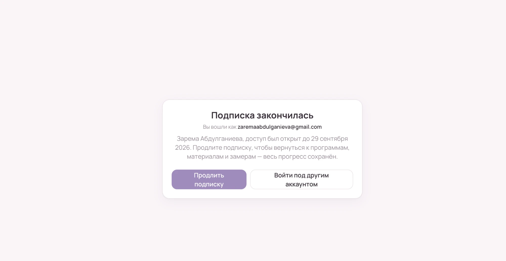

# Интеграции, CI/CD, мониторинг и логирование

Демо-кабинет Lerree Lab: React 19 + Vite на Vercel, база и вход — Supabase. Документ описывает, как устроена выкладка, какие внешние сервисы подключены и как их повторить с нуля.

**Боевой адрес:** <https://lerree-lab-dz-cicd.vercel.app> · **Проверка здоровья:** <https://lerree-lab-dz-cicd.vercel.app/api/health>

Содержание:

1. [CI/CD](#1-cicd)
2. [Аудит безопасности](#2-аудит-безопасности)
3. [Вход через Google (OAuth 2.0)](#3-вход-через-google-oauth-20)
4. [Аналитика: Яндекс.Метрика](#4-аналитика-яндексметрика)
5. [Мониторинг и Health Check](#5-мониторинг-и-health-check)
6. [Логирование](#6-логирование)
7. [Оптимизация](#7-оптимизация)
8. [Как использовался ИИ](#8-как-использовался-ии)
9. [Переменные и секреты](#9-переменные-и-секреты)

---

## 1. CI/CD

**Платформа:** GitHub Actions. **Хостинг:** Vercel (Hobby). Конфигурация — [`.github/workflows/ci-cd.yml`](.github/workflows/ci-cd.yml), обновления зависимостей — [`.github/dependabot.yml`](.github/dependabot.yml).

### Что происходит и когда

```
pull request ──► Проверки качества ──► Превью на Vercel ──► ссылка комментарием в PR
push в main  ──► Проверки качества ──► Выкладка на Vercel ──► проверка /api/health
```

**Проверки качества** (одинаковые для всех веток, ~30 с):

| Шаг                | Команда                 | Падает, если                                         |
| ------------------ | ----------------------- | ---------------------------------------------------- |
| Установка          | `npm ci`                | lock-файл не совпадает с package.json                |
| Форматирование     | `npm run format:check`  | код не отформатирован Prettier                       |
| Линтер             | `npm run lint` (oxlint) | ошибки линтера                                       |
| Типы               | `npm run typecheck`     | ошибки TypeScript                                    |
| Тесты + покрытие   | `npm run test:coverage` | хоть один тест упал (85 тестов, покрытие ~87 %)      |
| Уязвимости         | `npm run audit:deps`    | уязвимость уровня high+ в том, что уходит на сайт    |
| Сборка             | `npm run build`         | не собирается                                        |

Отчёт о покрытии сохраняется артефактом прогона на 7 дней.

**Выкладка** — только из `main` и только если проверки прошли:

1. `vercel pull` — настройки проекта из Vercel.
2. Подстановка `VITE_SUPABASE_*` из секретов GitHub. В Vercel эти переменные помечены как секретные, и `vercel pull` отдаёт вместо них заглушку. Без этого шага кабинет собирался без базы — так и было на первой выкладке, см. коммит `a4a20c9`.
3. `vercel build --prod` и проверка, что адрес базы действительно попал в собранные файлы.
4. `vercel deploy --prebuilt --prod --env APP_VERSION=<коммит>`.
5. **Проверка после выкладки:** до 6 попыток запросить `/api/health`. Ждём `"status":"ok"` и `"version"`, равную коммиту. Так видно, что отвечает новая сборка, а не старая.

Автодеплой Vercel из git выключен (`git.deploymentEnabled: false` в `vercel.json`): выкладывает только пайплайн, поэтому непроверенный код на сайт не попадёт.

**Превью:** для каждого PR — отдельная копия сайта, ссылка приходит комментарием. PR от Dependabot секреты не получают, для них идут только проверки качества.

**Dependabot:** npm — раз в неделю, GitHub Actions — раз в месяц. Связанные пакеты обновляются группой: react + react-dom, vitest + @vitest/*. Первые PR, которые шли поодиночке, как раз ломали сборку. Major-версия TypeScript пока игнорируется: у TypeScript 7 нет программного интерфейса, через который Vercel собирает функции.

### Как повторить

1. Vercel → Add New → Project → импорт репозитория, Framework: Vite. В Settings → Git выключить автодеплой (или оставить `vercel.json` как есть).
2. Vercel → Settings → Environment Variables: `VITE_SUPABASE_URL`, `VITE_SUPABASE_ANON_KEY` (Production и Preview).
3. Vercel → Account Settings → Tokens → создать токен.
4. GitHub → Settings → Secrets and variables → Actions:
   - **Secrets:** `VERCEL_TOKEN`, `VITE_SUPABASE_URL`, `VITE_SUPABASE_ANON_KEY`
   - **Variables:** `VERCEL_ORG_ID`, `VERCEL_PROJECT_ID` (из `.vercel/project.json` после `vercel link`), `PRODUCTION_URL`
5. Пуш в `main` — прогон во вкладке Actions.

Если чего-то не хватает, шаг «Проверка настроек Vercel» падает с понятным сообщением, какой секрет задать.

### Проверено

- Выкладка с нуля: прогон `36349169969` — зелёный, сайт отвечает, версия совпала.
- Превью на PR: PR #10 и #13 — ссылка пришла комментарием.
- Защита от поломки: на первой выкладке кабинет собрался без базы, это нашлось вручную. После правки `a4a20c9` такая сборка останавливается ещё до выкладки.

---

## 2. Аудит безопасности

Полный отчёт — [security_audit.md](security_audit.md). Кратко: 6 находок (2 высоких, 1 средняя, 3 низких), все исправлены.

- Любой зарегистрировавшийся получал 30 дней подписки.
- Опубликованный демо-пароль можно было сменить.
- Не было CSP и защитных заголовков.
- Гость мог вызывать функции проверки прав.
- `/api/health` отдавал наружу текст внутренних ошибок.
- Уязвимость `undici` в тестовом окружении.

Защита от типовых атак:

- **XSS:** React экранирует вывод, в коде нет `innerHTML`/`dangerouslySetInnerHTML`. Строгий CSP: скрипты, стили и шрифты — только с нашего домена.
- **SQL-инъекции:** SQL в приложении не собирается, запросы идут через PostgREST с параметрами. Проверки `check` стоят в самой базе.
- **CSRF:** не применимо — вход передаётся заголовком `Authorization: Bearer`, cookie не используются.
- **Доступ к чужим данным:** RLS на всех таблицах, 12 проверок в `scripts/check-rls.sql`.

---

## 3. Вход через Google (OAuth 2.0)

**Провайдер:** Google через Supabase Auth. Supabase хранит Client Secret и меняет код Google на сессию; наш код секрета не видит.

### Как работает

```
Кнопка «Войти через Google»
  → supabase.auth.signInWithOAuth({ provider: 'google', redirectTo: <сайт>/login })
  → accounts.google.com — выбор аккаунта и согласие (prompt=select_account)
  → <проект>.supabase.co/auth/v1/callback — Supabase проверяет ответ Google
  → <сайт>/login?code=…  — одноразовый код
  → auth-js меняет код на сессию (PKCE: без секрета из этого браузера код бесполезен)
  → профиль из таблицы profiles → экран по статусу подписки
```

**Новая учётная запись** получает профиль с истёкшей подпиской (миграция 006) и видит «Подписка закончилась — вы вошли как ‹почта›». Так видно, что данные пользователя от Google пришли. Контент при этом закрыт, доступ открывает администратор. Имя берётся из `full_name` Google.

**Ошибки** ([`src/lib/oauth.ts`](src/lib/oauth.ts)): Google возвращает их в адресе (`?error=…` или `#error=…`). Участница видит понятный текст, технический код пишется в журнал (`scope: auth.google`), адрес очищается.

| Что случилось                    | Код                                     | Текст на экране                            |
| -------------------------------- | --------------------------------------- | ------------------------------------------ |
| нажала «Отмена» у Google         | `access_denied`                         | «Вход через Google отменён…»               |
| ссылка устарела / другой браузер | `invalid_request`, `bad_oauth_state`    | «Ссылка для входа устарела…»               |
| сбой Google или Supabase         | `server_error`                          | «Google сейчас не пускает в кабинет…»      |
| что-то ещё                       | любой                                   | общий текст + код в журнал                 |

### Как настроить

**Google Cloud Console** (console.cloud.google.com):

1. Новый проект `lerree-lab-dz`.
2. APIs & Services → OAuth consent screen: External, название, почта поддержки и разработчика. Логотип не добавлять: с ним Google требует проверку.
3. Branding → Application home page `https://lerree-lab-dz-cicd.vercel.app`, Privacy policy `…/privacy`, Authorized domain `lerree-lab-dz-cicd.vercel.app`. Audience → **Publish app**. Пока приложение в режиме Testing, войти могут только тестировщики из списка.
4. Clients → Create client → Web application:
   - Authorized JavaScript origins: `https://lerree-lab-dz-cicd.vercel.app`
   - Authorized redirect URIs: `https://<проект>.supabase.co/auth/v1/callback`
5. Скопировать Client ID и Client Secret.

**Supabase:**

1. Authentication → Sign In / Providers → Google: включить, вставить Client ID и Secret.
2. Authentication → URL Configuration → Redirect URLs: `https://lerree-lab-dz-cicd.vercel.app/**`, `http://localhost:5180/**`.

**Код:** [`src/lib/api.ts`](src/lib/api.ts) (`loginWithGoogle`), [`src/lib/supabase.ts`](src/lib/supabase.ts) (`flowType: 'pkce'`, `detectSessionInUrl: true`), [`src/pages/LoginPage.tsx`](src/pages/LoginPage.tsx), [`src/pages/PrivacyPage.tsx`](src/pages/PrivacyPage.tsx).

### Проверено

- Тесты: адрес возврата, параметры запроса, 5 видов ошибок, ошибка сети ([`oauth.test.ts`](src/lib/__tests__/oauth.test.ts), [`api.test.ts`](src/lib/__tests__/api.test.ts)).
- Вручную: отмена у Google показывает понятный текст, код ошибки попадает в журнал, адрес очищается.
- ✅ Сквозной вход живым Google-аккаунтом на боевом адресе (30.09, версия `fd47b55`). Новая учётная запись попала на экран «Подписка закончилась». Имя и почта пришли из Google, контент закрыт — сработала защита SEC-01.



Приложение в Google пока в режиме **Testing**: входить через Google могут только тестировщики из списка в Google Console. Проверяющий входит по демо-паролю (`anna@demo.ru` / `demo1234`) или присылает свою Google-почту для добавления в тестировщики.

---

## 4. Аналитика: Яндекс.Метрика

⏳ _Раздел заполняется после создания счётчика._

---

## 5. Мониторинг и Health Check

### `/api/health`

Серверная функция Vercel ([`api/health.ts`](api/health.ts)). По отдельности проверяет всё, без чего кабинет не работает:

- `auth` — сервис входа Supabase (`/auth/v1/health`);
- `database` — сама база выполняет запрос (функция `health_check()`, миграция 005).

Ответ **200**, если всё в порядке, **503** — если нет. У каждой проверки 4 секунды на ответ. Кеш выключен.

```json
{
  "status": "ok",
  "checks": {
    "auth": { "ok": true, "latencyMs": 146 },
    "database": { "ok": true, "latencyMs": 137 }
  },
  "version": "823ab19",
  "time": "2026-09-28T09:16:02.203Z"
}
```

Текст ошибок наружу не отдаётся, только в журнал (SEC-05). `version` — коммит, по нему CI убеждается, что отвечает новая сборка.

### Внешний монитор с оповещениями

**GitHub Actions по расписанию** — [`.github/workflows/uptime.yml`](.github/workflows/uptime.yml). Выбран вместо UptimeRobot: работает в том же репозитории, без отдельного аккаунта и ключей. Для публичного репозитория минуты бесплатны.

- **Как часто:** каждые 15 минут. GitHub может запаздывать на несколько минут.
- **Что считается сбоем:** 3 попытки подряд с паузой 20 с, и ни одна не вернула `200` и `"status":"ok"`. Одиночный сетевой сбой тревогу не поднимает.
- **Алерты:**
  1. прогон становится красным — GitHub присылает владельцу письмо о падении;
  2. открывается issue «Сайт недоступен» с ответом сервера — ещё одно письмо и видимая запись об аварии;
  3. пока issue открыт, новые сбои дописываются в него комментарием, а не новым письмом;
  4. когда сайт снова отвечает, issue закрывается комментарием «✅ снова работает».
- **Проверить оповещение, не ломая сайт:** Actions → Мониторинг → Run workflow → в поле `url` указать несуществующий адрес. Откроется issue. Затем Run workflow с пустым полем — issue закроется.
- **Ограничения:** интервал 15 минут может пропустить короткую аварию. При 60 днях без коммитов GitHub сам выключает расписание (включается кнопкой в Actions).

Логику оповещений проверили до выкладки на подставном GitHub API. Прогоны «ок → сбой → сбой → ок → ок» дали: issue открыт → комментарий → закрыт → тишина.

### Встроенное в Vercel

- **Deployments** — история выкладок с логом сборки, откат в один клик (Promote).
- **Logs** — журнал функций (см. раздел 6).
- **Observability** (Hobby) — число вызовов, ошибки и время ответа функций.

---

## 6. Логирование

### Формат

Одна запись — одна строка JSON. Поля одинаковые у сервера и браузера:

```json
{
  "time": "2026-09-29T08:07:41.530Z",
  "level": "error",
  "scope": "client",
  "message": "server: Сервер не смог обработать запрос.",
  "clientScope": "api.saveSets",
  "details": "500 | canceling statement due to statement timeout",
  "version": "823ab19",
  "session": "a1b2c3d4",
  "path": "/workouts/…"
}
```

**Уровни:** `info` — штатные события (вход, сессия восстановлена, проверка здоровья в порядке); `warn` — ожидаемые неудачи (отмена входа, истёкшая сессия); `error` — сбои.

### Где пишется и где хранится

| Источник           | Модуль                                     | Куда                                      |
| ------------------ | ------------------------------------------ | ----------------------------------------- |
| Серверные функции  | [`api/_lib/log.ts`](api/_lib/log.ts)       | stdout → **Vercel Logs**                  |
| Браузер участницы  | [`src/lib/logger.ts`](src/lib/logger.ts)   | консоль браузера + буфер 50 событий       |
| Браузер → сервер   | `warn`/`error` → [`api/log.ts`](api/log.ts) | **Vercel Logs** с `scope: client`         |
| База и вход        | Supabase                                   | Supabase → Logs (API, Postgres, Auth)     |

**Централизованное хранение:** ошибки из браузеров участниц лежат в Vercel Logs рядом с серверными — одним фильтром `scope:client` видно, у кого и что сломалось, даже если участница ничего не написала. Браузер отправляет не больше 20 записей за вкладку (`navigator.sendBeacon`). Приёмник отклоняет всё, что не похоже на запись журнала, и обрезает длинные поля. Срок хранения на Hobby — 1 час, для долгого хранения нужен Log Drain на платном тарифе. Поэтому для разбора журнал выгружается (Logs → Export).

### Анализ логов с ИИ

[docs/log-analysis/README.md](docs/log-analysis/README.md):

- 3 промпта: разбор инцидента, поиск подозрительной активности, регрессия после выкладки;
- тестовый журнал [`sample-incident.jsonl`](docs/log-analysis/sample-incident.jsonl): сбой базы вперемешку с обычными ошибками пользователей;
- скрипт-сводка `node scripts/summarize-logs.mjs <файл>`;
- разбор Claude Code и ручная проверка его выводов.

ИИ правильно:

- свёл 6 записей в один инцидент — таймаут базы;
- отделил 4 штатные ситуации — истёкшая сессия, дубль замера, пропал интернет, отмена входа;
- заметил попытки засорить приёмник логов.

Одну гипотезу («двойной клик на кнопке сохранения») он сам пометил «проверить», и проверка её опровергла.

---

## 7. Оптимизация

Страница `/login` — первая, которую видит любой посетитель.

| Показатель                         | До (30.09, `823ab19`) | После (30.09, `0a62de3`) |
| ---------------------------------- | --------------------- | ------------------------ |
| Performance                        | 78–86                 | **98–99**                |
| First Contentful Paint             | 3,2–3,9 с             | **1,6–1,8 с**            |
| Accessibility                      | 91                    | **100**                  |
| SEO                                | 91                    | **100**                  |
| Best Practices                     | 100                   | 93 → 100 (см. ниже)      |
| JavaScript на странице входа (сжатый) | 147 КБ             | **118 КБ**               |
| Запросы к чужим серверам           | 3 (Google Fonts)      | **0**                    |

Что предложил ИИ по отчёту Lighthouse и что сделано:

1. **Лишний код Supabase** (≈100 КБ неиспользуемого JS). `createClient` тянул хранилище файлов, realtime, функции. Заменён на две нужные части — `@supabase/auth-js` и `@supabase/postgrest-js` ([`src/lib/supabase.ts`](src/lib/supabase.ts)). Основной файл: 494 → 399 КБ.
2. **Разделы по требованию** — `React.lazy`. Код тренировок, замеров и материалов не грузится до входа.
3. **Шрифт с нашего домена** (`@fontsource-variable/manrope`) вместо Google Fonts: минус два чужих соединения, блокирующих показ. Попутно CSP стал строже, а Google не видит посетителей.
4. **Контраст** серого текста и основной кнопки не проходил WCAG AA (3,0 при норме 4,5). Цвета затемнены с сохранением оттенка: `#9a8a98 → #736472`, `#a48bc1 → #8467a8`.
5. **robots.txt** — раньше по этому адресу отдавалась страница кабинета.

**Что нашёл замер «после».** Best Practices упал до 93: в консоли появилась ошибка CSP. Vite встроил самый маленький файл шрифта (2,5 КБ, расширенная кириллица) прямо в CSS как `data:`-адрес, а `font-src 'self'` такие шрифты не пускает. На вид это не влияло — обычная кириллица и латиница грузились. Но ошибка есть ошибка. Исправлено в сборке, а не ослаблением CSP: `build.assetsInlineLimit` в [`vite.config.ts`](vite.config.ts) больше не встраивает шрифты.

Замеры: Lighthouse 12, мобильный профиль, 2–3 прогона на боевом адресе.

Что не делали: разбивать React и React Router на отдельные файлы нет смысла, они нужны на первом же экране.

---

## 8. Как использовался ИИ

Инструмент — **Claude Code** (Opus 5.5) в терминале, на реальном проекте. Автор ставит задачу и подтверждает каждый шаг. Пуш в репозиторий и все действия в личных кабинетах (Google, Supabase, Vercel) делает автор: секреты ИИ не вводит.

| Шаг задания           | Что сделал ИИ                                                                                                                        | Что проверялось руками                                          |
| --------------------- | ------------------------------------------------------------------------------------------------------------------------------------ | --------------------------------------------------------------- |
| CI/CD                 | сгенерировал `ci-cd.yml` и `dependabot.yml`; нашёл, почему кабинет собирается без базы (заглушка `[SENSITIVE]`), и добавил защиту      | зелёные прогоны, вход на боевом адресе                          |
| Аудит                 | прошёл код по OWASP Top 10, каждую находку подтвердил запросом к живой базе                                                          | миграцию 006 выполнил автор, результат проверен повторно        |
| Зависимости           | разобрал 9 PR Dependabot, собрал в один набор, отклонил TypeScript 7 с обоснованием                                                  | превью PR #10                                                   |
| OAuth                 | написал поток входа, обработку ошибок, страницу политики                                                                            | настройку консолей Google и Supabase делал автор                |
| Логи                  | формат JSON, приёмник ошибок, промпты, разбор тестового инцидента                                                                   | выводы сверены с журналом, одна гипотеза опровергнута           |
| Оптимизация           | прочитал отчёт Lighthouse, измерил состав файла по source map, предложил и сделал правки                                            | вход, программы, замеры, тренировка — на живой базе             |

---

## 9. Переменные и секреты

| Имя                      | Где                              | Секрет | Зачем                                  |
| ------------------------ | -------------------------------- | ------ | -------------------------------------- |
| `VITE_SUPABASE_URL`      | GitHub Secrets, Vercel, `.env`   | нет*   | адрес Supabase                         |
| `VITE_SUPABASE_ANON_KEY` | GitHub Secrets, Vercel, `.env`   | нет*   | публичный ключ (данные защищает RLS)   |
| `VERCEL_TOKEN`           | GitHub Secrets                   | **да** | выкладка из Actions                    |
| `VERCEL_ORG_ID`          | GitHub Variables                 | нет    | команда в Vercel                       |
| `VERCEL_PROJECT_ID`      | GitHub Variables                 | нет    | проект в Vercel                        |
| `PRODUCTION_URL`         | GitHub Variables                 | нет    | адрес для проверки после выкладки      |
| `APP_VERSION`            | ставит CI при выкладке           | нет    | коммит в ответе `/api/health`          |
| Google Client Secret     | только Supabase                  | **да** | обмен кода Google на сессию            |

\* Публичные по смыслу — они всё равно видны в браузере. В секретах лежат, чтобы не светить адрес демо-базы в логах CI.
